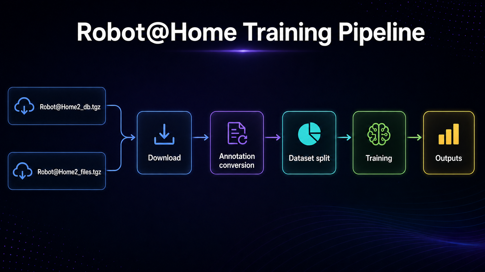

# YOLO Training Pipeline for Robot@Home Dataset

YOLO instance segmentation pipeline trained on the [Robot@Home 2](https://zenodo.org/record/7811795) dataset. Main Orchestrated with **MLflow Projects** and **Hydra**, tracked with **MLflow Tracking**, versioned with **DVC** but possibility to use **WandB**

> **⚠️ Disclaimer:** This is a purely academic project created for research and experimentation purposes only. It is still in progress and not intended for production use.
> Status: In Progress (Green: Individual Steps and Component works Yellow: Whole Piepeline, DVC versioning missing)

<p float="centre">
  
</p>

## Demo

This demo shows **annotated video output** generated by the trained YOLO segmentation model from this pipeline.

- Output type: segmentation overlays + class-name labels
- Source: video inference using the trained checkpoint (`best.pt`)
- YouTube demo: https://youtu.be/vc1AB-xLFHM?si=WSlydTxvV85FrrdT

---

## Pipeline Overview

```
download → annotation_convert → split → training → inference
```

| Step | Location | What it does |
|---|---|---|
| `download` | `src/download/` | Downloads Robot@Home 2 tarballs, verifies MD5, extracts to `data/` |
| `annotation_convert` | `src/annotation_convert/` | Converts Robot@Home DB labels → YOLO segmentation format, remaps class IDs |
| `split` | `src/split/` | Stratified or random train/val/test split of the YOLO dataset |
| `training` | `components/training/` | Trains YOLO segmentation model, validates on test split, saves metrics and plots |
| `inference` | `components/inference/` | Runs segmentation on images/videos/streams and saves annotated output |

---

## Experiments 
Snapshot of few runs executed on mlflow and can be analysed on default ui avaiable as shown below


## Project Structure

```
.
├── main.py                   # Pipeline orchestrator (Hydra + MLflow)
├── params.yaml               # All pipeline parameters
├── MLproject                 # Root MLflow project entry point
├── src/
│   ├── download/             # Step: dataset download
│   ├── annotation_convert/   # Step: Robot@Home → YOLO conversion
│   └── split/                # Step: train/val/test split
├── components/
│   ├── training/             # Component: YOLO model training & evaluation
│   └── inference/            # Component: YOLO segmentation inference
├── shared/
│   ├── utils.py              # Shared utilities (I/O, plotting, GPU info)
│   └── annotator.py          # Shared segmentation annotation helpers
└── data/                     # Data root (DVC-tracked)
    ├── rh.db                 # Robot@Home SQLite database
    ├── files/                # Raw RGBD and scene files
    ├── yolo/                 # Converted YOLO labels and images
    ├── training/             # Train/val/test split dataset
    └── results/              # Training run outputs
```

---

## Requirements

- Python 3.12  
- CUDA 12.6 compatible GPU  (For faster Training otherwise works on CPU by default)
- [Robot@Home 2 dataset](https://zenodo.org/record/7811795)

Install dependencies:

```cmd
pip install -r requirements.txt
```

---

## Configuration

All parameters are in `params.yaml`. Key paths are relative to the step component's working directory (`..\..\data\...` = `data/` from repo root).

```yaml
training:
  dataset_root: '..\..\data\training'   # split dataset input
  output_root:  '..\..\data\results'    # run artifacts output
  model_name:   yolo11s-seg.pt          # base checkpoint (downloaded to dataset_root)
  epochs:       50
  batch:        -1                       # AutoBatch
  device:       0                        # GPU index
```

---

## Running the Pipeline

Run all steps:

```cmd
python main.py
```

Run a specific step:

```cmd
python main.py main.steps=annotation_convert
python main.py main.steps=split
python main.py main.steps=training
```

Run multiple steps:

```cmd
python main.py main.steps=split,training
```

Override a parameter inline:

```cmd
python main.py main.steps=training training.epochs=100
```

---

## Outputs

| Path | Contents |
|---|---|
| `data/yolo/` | YOLO-format images and labels |
| `data/yolo/class_id_to_name.json` | Semantic class mapping |
| `data/training/` | Stratified train/val/test split |
| `data/training/weights/` | Downloaded `.pt` base checkpoints |
| `data/results/data.yaml` | YOLO dataset metadata used for training |
| `data/results/runs/<run_name>/` | Training checkpoints, plots, results.csv |
| `data/results/test_metrics.json` | Final test-split evaluation metrics |
| `data/results/training_curves.png` | Loss and mAP training curves |

---

## MLflow Tracking

Runs are tracked in `mlflow.db` (SQLite). Launch the UI with:

```cmd
mlflow ui --backend-store-uri sqlite:///mlflow.db
```

Then open [http://localhost:5000](http://localhost:5000).

---

## DVC

Data is versioned with DVC. Pull tracked data:

```cmd
dvc pull
```

---

## Inference Component

The `inference` component runs YOLO segmentation on image folders, local videos, webcam, or RTSP/HTTP streams.


### Inputs

| Parameter | Description |
|---|---|
| `source` | Image folder/file, local video file, webcam index (`0`), or RTSP/HTTP stream URL |
| `model_path` | YOLO checkpoint (`.pt`) path or URL |
| `mapping_json` | Path to `class_id_to_name.json` used for label names |
| `output_dir` | Output directory for annotated results |

### Supported `model_path` Formats

| Format | Example | Notes |
|---|---|---|
| Local path | `C:\data\results\runs\robotathome_seg_strat\weights\best.pt` | Must exist locally |
| HTTP/HTTPS URL | `https://example.com/models/best.pt` | Auto-downloaded by Ultralytics |
| HuggingFace Hub | `hf://org/repo/best.pt` | Auto-downloaded by Ultralytics |
| Cloud Storage (S3/GCS/Azure) | Pre-download with `dvc pull`, then use local path | DVC handles credentials |

### Output Behavior

- If `source` is a **local video file**, output is a single annotated video:
  - `<video_name>_annotated.<ext>` (fallback to `.mp4` if codec/container mismatch)
- Otherwise (image folder/file, webcam, stream), output is annotated frames saved under `output_dir`.
- Progress is shown with `tqdm`:
  - total + percentage for deterministic local sources
  - running frame counter for live streams

### Run Examples

```cmd
python main.py main.steps=inference
```

```cmd
python main.py main.steps=inference inference.source=..\..\data\training\images\test
```

```cmd
python main.py main.steps=inference inference.source=..\..\data\inference\video\office_nav_01.mp4
```

```cmd
python main.py main.steps=inference inference.source=0
```

### Annotation Details (`shared/annotator.py`)

Annotation logic is centralized in `shared/annotator.py`:

- `colour_for(class_id)`
- `overlay_mask(img, mask, color, alpha)`
- `annotate_frame(frame, result, class_names, mask_alpha)`

Labels are placed near the densest mask region (not bbox corners), clamped inside frame boundaries, and rendered with a high-contrast style for visibility.

---
